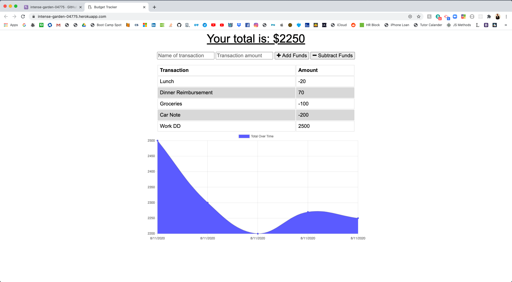
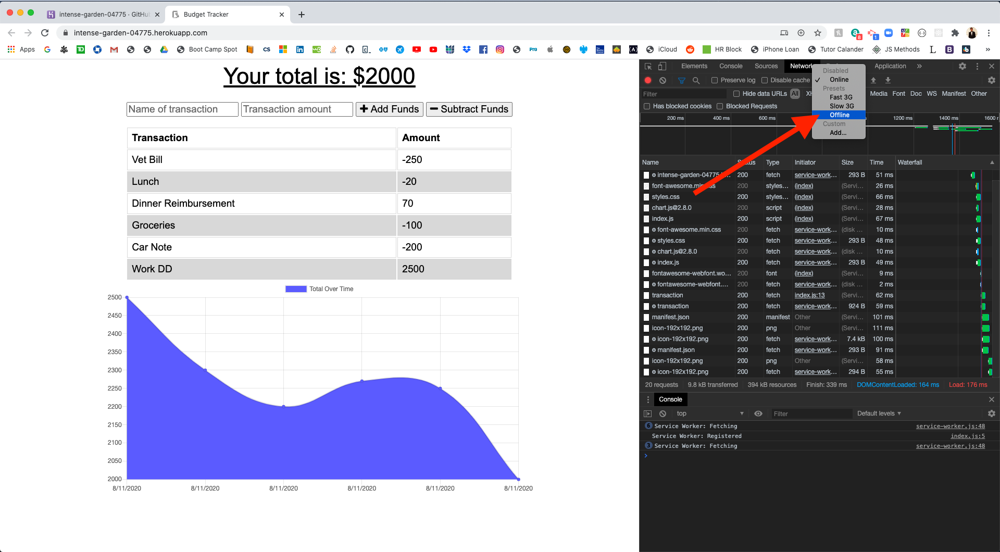

# Progressive-Budget

## Description 

This application allows the user to keep track of their budget and finances even without the internet. If a user enters personal financial data without the internet, their changes will remain once the application is back online (when you test offline, you may have to hit the refresh button twice to pull the homepage back up). 

## Technologies

* Express 
* Mongoose
* Mongo DB
* Morgan
* Service Worker
* Web Manifest

## Links

Github Repo: https://github.com/elock721/Progressive-Budget

Heroku Deployment: https://intense-garden-04775.herokuapp.com/

## Screenshots

* Home Page

* To test offline

